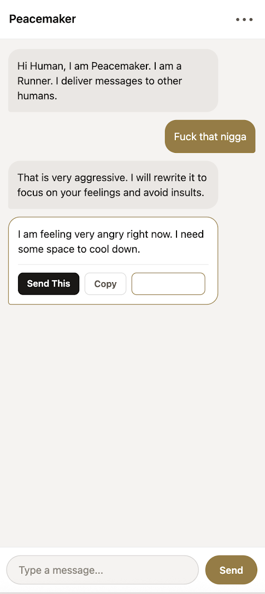
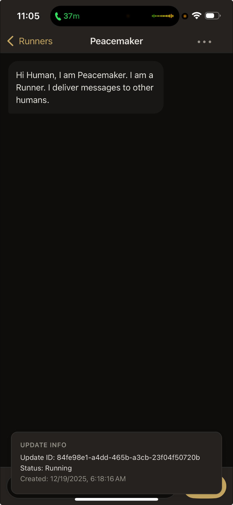

Ruwt Weekly #001: Dark Mode & The "Invisible Button"
1 message
Israel Afangideh <israelafangideh@gmail.com>	Sat, Dec 20, 2025 at 4:22 PM
To: Elias Afangideh <eliasafangideh@gmail.com>, Divine Ochelebe67 <ochelebedivine@gmail.com>, Girlzilla Reloaded <girlzillareloaded@gmail.com>
Good day everyone. This is the first of several periodic emails I will send to keep you updated on Ruwt. I hope that in the near future Ruwt will develop to the point where you receive these inside the application itself, instead of just by email. 

1. Naughty Bugs
A few days ago we added the dark mode to the app. This is a really cool feature because it respects your system default. So if you change your phone to dark mode, the app will automatically update to dark mode as well, and vice versa with light mode. 

However, while doing this, we introduced a very bad bug with the make kinder button (see below):

The button was impossible to see in light mode because both the text and the background were white. NO BUENO. We pushed several updates to fix this but for some reason they were not showing up in the app.

After a caffeinated, rage-filled debugging session, we fixed the deployment issue. We also added a pop up to display the currently installed app version on the device. This would let us see if the device had received over-the-air updates yet and save ourselves some debugging time in the future. However this pop up blocked the message input of the app on IOS and we carelessly shipped it in that state. See below:

 Thanks to our experience with the button bug, we fixed this one relatively quickly by moving this update info pop up to the loading screen and having it disappear when all runners have actually loaded.

We also fixed other, more straightforward bugs such as:
The keyboard covering the input while typing (Android/Samsung phones only)
PeaceMaker saying [Sent] on messages when you did not intend to send anything.

With these fixes, we have eliminated all bugs that render the application unusable. And we also strengthened our deployment pipelines to make fixing bugs and pushing updates much easier in the future. 

We now push updates to your devices multiple times a day, which is much faster than most other applications that only ship about once a week. Some of our updates are Over The Air (OTA) updates, so you may not get notifications, but your app still refreshes with bugfixes and improvements through out the day. As a result, if you report a bug or ask for an improvement, you can be sure that it will be added to your application very very quickly.

2. Future Features
 We are most excited about 3 features which we plan to add in the coming days:
Logins, user-to-user messaging, and even user-to-runner-to-user messaging
Ability to use the application on the website(ruwt.social) without downloading the app
Improved automated end to end testing and codebase organization (boring but necessary)
We plan to work on these three things over the next week, along with any bugs or improvement ideas you send our way.

Thank you for being one of the first people to use RUWT

Sincerely,

Israel Afangideh